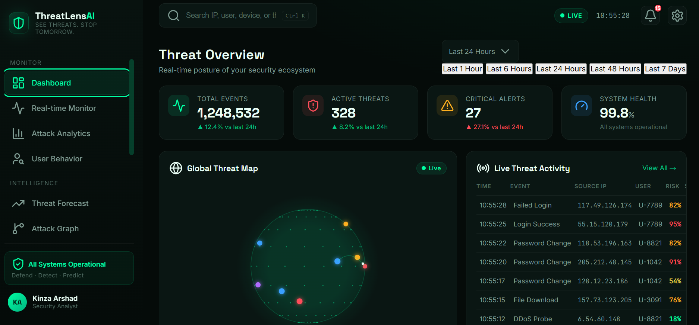

<div align="center">

# 🛡️ ThreatLens AI

### AI-Powered Cyber Threat Intelligence & Attack Prediction Platform

*Defend · Detect · Predict · Explain*

[](https://www.python.org/)
[](https://fastapi.tiangolo.com/)
[](https://www.postgresql.org/)
[](https://redis.io/)
[](https://www.docker.com/)
[](https://scikit-learn.org/)
[](https://xgboost.ai/)
[](#license)

</div>

<br>

<div align="center">

</div>

<br>

## Overview

**ThreatLens AI** is an end-to-end data science and machine learning platform for defensive cybersecurity. It ingests raw network traffic, cleans and engineers features from it, runs that data through **seven independent AI engines**, and surfaces the results through a real backend API and a live, animated security-operations dashboard.

The project was built in five phases — data pipeline, AI engines, backend, infrastructure, and frontend — each one implemented, tested, and verified working before moving to the next, rather than assembled all at once.

---

## What's inside

| Layer | What it does |
|---|---|
| 🖥️ **Frontend Dashboard** | 12-page security operations UI — live threat feed, animated rotating threat globe, attack analytics, SHAP explainability, AI analyst chat, alerts, reports, system health |
| 🧠 **7 AI Engines** | Anomaly detection, attack classification, threat scoring, explainability, user behavior analytics, relationship graphing, forecasting |
| ⚙️ **Backend API** | FastAPI service exposing every engine as a real, tested REST endpoint |
| 🗄️ **Data Layer** | PostgreSQL (production) / SQLite (local dev) + Redis caching with automatic in-memory fallback |
| 🐳 **Infrastructure** | Docker Compose (API + PostgreSQL + Redis, one command), GitHub Actions CI (lint + test + build) |

---

## Dataset

**[CICIDS2017](https://www.kaggle.com/datasets/chethuhn/network-intrusion-dataset)** — the Canadian Institute for Cybersecurity's Intrusion Detection dataset. Real, labeled network traffic captured across 5 days, covering Benign, Brute Force, DoS/DDoS, Port Scanning, Web Attack, Botnet, and Infiltration traffic — over 2.8 million rows and 78 flow-level features.

---

## The 7 AI engines

Each engine has its own notebook (`notebooks/`) with step-by-step, markdown-explained analysis, and its own reusable module (`src/models/`) that both the notebook **and** the live API import — so what's evaluated offline is exactly what runs in production.

| # | Engine | Model(s) used | Notebook |
|---|---|---|---|
| 1 | **Anomaly Detection** | Isolation Forest (unsupervised) | `02_anomaly_detection.ipynb` |
| 2 | **Attack Classification** | Random Forest vs. XGBoost, compared head-to-head on macro F1 | `03_attack_classifier.ipynb` |
| 3 | **Explainability** | SHAP (TreeExplainer) — global + per-alert local explanations | `04_shap_explainability.ipynb` |
| 4 | **Threat Scoring** | Weighted rule engine combining anomaly score + classifier confidence + attack-type severity into one 0–100 score | `05_threat_scoring.ipynb` |
| 5 | **User Behavior Analytics** | Per-entity baseline modeling + deviation scoring | `06_user_behavior_analytics.ipynb` |
| 6 | **Attack Relationship Graph** | NetworkX directed graph + centrality ranking | `07_attack_relationship_graph.ipynb` |
| 7 | **Threat Forecasting** | Gradient-boosted regression on lag/rolling/calendar features (1h / 6h / 24h horizons) | `08_threat_forecasting.ipynb` |

### Outputs produced

- Cleaned, deduplicated, feature-engineered dataset (`data/processed/cicids2017_cleaned.parquet`)
- Trained, saved models for every engine (`models/`)
- Per-class precision / recall / F1 and confusion matrices for the classifier
- SHAP summary plots (global) and per-alert feature-contribution breakdowns (local)
- A combined 0–100 threat score + Low/Medium/High/Critical severity label per event
- Behavioral deviation scores per entity, ranked by risk
- A directed attack graph with suspicious-node ranking
- 1h / 6h / 24h threat probability forecasts with MAE/RMSE evaluation

---

## Architecture

```
Raw Network Logs (CICIDS2017)
        |
        v
  Ingestion & Cleaning  ------------  src/ingestion/  ·  src/preprocessing/
        |
        v
 +--------------------------------------------------------+
 |                     AI ENGINES                          |
 |  Anomaly Detection · Attack Classifier · SHAP            |
 |  Threat Scoring · UBA · Attack Graph · Forecasting         |
 +--------------------------------------------------------+
        |                                    src/models/
        v
   FastAPI Backend  --------------------------  api/
        |
        +-- PostgreSQL   (persistent storage)     src/database/
        +-- Redis        (caching layer)           src/cache/
        +-- AI Analyst   (evidence-based Q&A)        src/analyst/
        |
        v
   Live Dashboard (HTML/CSS/JS)
```

---

## Tech stack

**Data & ML:** Python · Pandas · NumPy · scikit-learn · XGBoost · SHAP · NetworkX
**Backend:** FastAPI · SQLAlchemy · PostgreSQL · Redis · Pydantic
**Frontend:** HTML5 · CSS3 · JavaScript (vanilla, no framework) · Chart.js · Canvas API
**Infrastructure:** Docker · Docker Compose · GitHub Actions
**Testing:** pytest · ruff

---

## Project structure

```
ThreatLens-AI/
├── data/
│   ├── raw/                    # source CSVs (not committed)
│   ├── processed/              # cleaned dataset (generated)
│   └── external/
├── notebooks/                  # all 8 notebooks, in order
├── src/
│   ├── ingestion/               # raw data loading
│   ├── preprocessing/            # cleaning + validation
│   ├── models/                    # all 7 AI engines + model registry
│   ├── database/                   # SQLAlchemy models + session
│   ├── cache/                       # Redis client (with fallback)
│   └── analyst/                      # AI Security Analyst
├── api/
│   ├── main.py                  # FastAPI entry point
│   ├── schemas/                  # Pydantic request/response models
│   └── routes/                    # health, events, threats, users,
│                                    # forecast, graph, analyst, analytics
├── models/                     # trained model artifacts (generated)
├── tests/                      # pytest suite
├── docs/images/                # README assets
├── .github/workflows/ci.yml    # lint + test + Docker build
├── Dockerfile
├── docker-compose.yml
├── requirements.txt
└── README.md
```

---

## Getting started

### 1 — Install dependencies

```bash
python -m venv venv
source venv/bin/activate        # Windows: venv\Scripts\activate
pip install -r requirements.txt
```

### 2 — Get the data

Download the 8 [CICIDS2017 CSV files](https://www.kaggle.com/datasets/chethuhn/network-intrusion-dataset) and place them in `data/raw/`.

### 3 — Run the notebooks, in order

```bash
jupyter notebook notebooks/01_eda_and_cleaning.ipynb
jupyter notebook notebooks/02_anomaly_detection.ipynb
jupyter notebook notebooks/03_attack_classifier.ipynb
jupyter notebook notebooks/04_shap_explainability.ipynb
jupyter notebook notebooks/05_threat_scoring.ipynb
jupyter notebook notebooks/06_user_behavior_analytics.ipynb
jupyter notebook notebooks/07_attack_relationship_graph.ipynb
jupyter notebook notebooks/08_threat_forecasting.ipynb
```

Each one saves its trained model(s) into `models/`, ready for the API to load.

### 4 — Run the backend

```bash
uvicorn api.main:app --reload --port 8000
```

Open **http://localhost:8000/docs** for the interactive, auto-generated API explorer.

**Or run the full stack with Docker** (API + PostgreSQL + Redis):

```bash
docker compose up --build
```

### 5 — Run the tests

```bash
pytest tests/ -v
```

### 6 — Open the dashboard

Open `index.html` in a browser, or serve it locally:

```bash
python -m http.server 8080
```

---

## API endpoints

| Method | Endpoint | Purpose |
|---|---|---|
| `GET` | `/health` | API, database & cache status |
| `POST` | `/events` | Ingest a raw security event |
| `POST` | `/detect` | Run the full AI pipeline on an event -> anomaly + classification + threat score |
| `GET` | `/threats` | List alerts, filterable by severity |
| `GET` | `/threats/{id}` | Get one alert's full detail |
| `GET` | `/users/{id}/risk` | A user/entity's aggregate risk |
| `GET` | `/users/{id}/profile` | UBA baseline for one entity |
| `GET` | `/forecast` | Latest 1h/6h/24h threat forecast |
| `GET` | `/graph/{entity_id}` | Attack relationship graph around one entity |
| `POST` | `/analyst/query` | Ask the AI Security Analyst an evidence-based question |
| `GET` | `/analytics/overview` | Dashboard KPI numbers |

---

## Project status

| Component | Status |
|---|---|
| Data pipeline (ingestion, cleaning, validation) | ✅ Complete |
| All 7 AI engines | ✅ Complete |
| FastAPI backend (all endpoints) | ✅ Complete |
| PostgreSQL schema + Redis caching | ✅ Complete |
| AI Security Analyst | ✅ Complete |
| Docker + CI/CD + test suite | ✅ Complete |
| Frontend dashboard | ✅ Complete |
| Frontend connected to live API data | 🔜 Planned (currently runs on simulated demo data) |
| Public deployment | 🔜 Planned |

---

## Author

**Kinza Arshad**
Data Science Student
[GitHub](https://github.com/kinza-arshad46) · [LinkedIn](https://linkedin.com/in/kinza-arshad-49a241373) · [Kaggle](https://kaggle.com/kinzaarhsad4646)

---

## License

This project is licensed under the MIT License.
